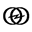
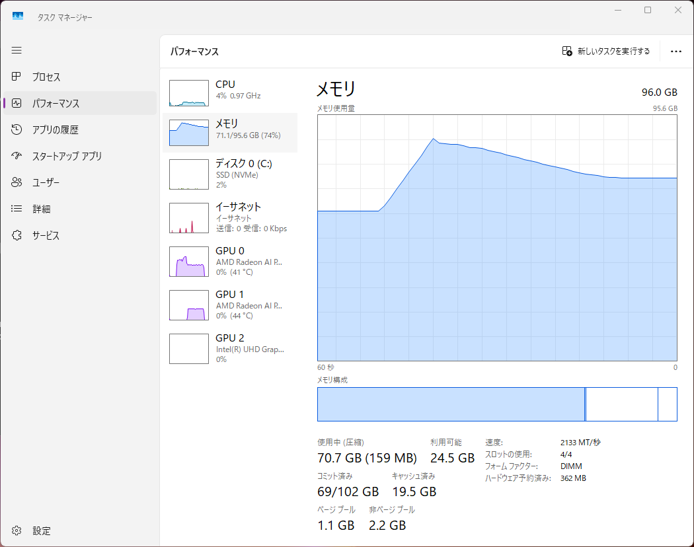
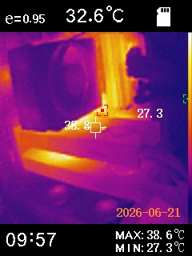
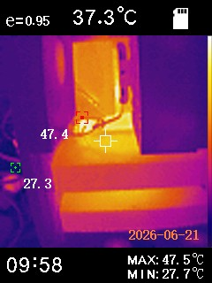

  
ローカル LLM 素人が作るローカル LLM 検証機

# ローカル LLM 素人が作るローカル LLM 検証機

<aside class="publication-note">
  
Information

  
これは 2026 年 6 月 21 日にQiitaで掲載しました。適宜、加筆修正しています。

  
掲載元：https://qiita.com/mitsuharu_e/items/92a3eccb65d9b5c4ceca

</aside>

<!-- textlint-disable -->

個人的に試しているローカル LLM 検証機を更新しました。自作 PC 趣味でゲーム用途の他にローカル LLM という目的を持ってしまったため、色々とイジッていたらマルチ GPU 構成になりました。ローカル LLM の個人検証機の構成例を調べてましたが、マルチ GPU の例はあまり見なかったので、記録として残しておきます。

  
  

    
Mitsuharu Emoto（@mitsuharu_e）の投稿 / X

    
x.com

    
https://x.com/mitsuharu_e/status/2068555740013527394

  

  
  

    
Mitsuharu Emoto（@mitsuharu_e）の投稿 / X

    
x.com

    
https://x.com/mitsuharu_e/status/2073625317911179567

  

## 検証機のコンセプトとゴール

今回組んだ検証機のコンセプトは「小中規模のモデルを円滑に動かす」です。これまでもローカル LLM を動かすために PC を組んできましたが、計算負荷が大きく、モデルによって動作が不安定になりました。それらの改善を目指しました。

具体的にターゲットとしているのは、以下のようなモデルです。

- gemma-4-e4b や qwen3.6-35b-a3b といった VRAM 24 GB 以下向けの定番モデル

  
  

    
Ollama のモデル・ライブラリ

    
ollama.com

    
https://ollama.com/library/qwen3.6

  

  
  

    
Ollama のモデル・ライブラリ

    
ollama.com

    
https://ollama.com/library/gemma4

  

- 少し大きい qwen3-coder-next などの VRAM 32 〜 50 GB のモデル

  
  

    
Ollama のモデル・ライブラリ

    
ollama.com

    
https://ollama.com/library/qwen3-coder-next

  

これらを超える大・超大規模モデルは、私には手に負えないのです。これらの場合は Ollama Cloud や OpenCode Go などのクラウド型ローカル LLM を選択する戦略です。

クラウド？型のローカル？と聞いて、矛盾を感じる方もいると思います。私自身も矛盾や混乱を感じますが、いずれは必要になる手段の１つだと思います。

オープンウェイトモデルは誰でも利用できるように公開されています。一般のクラウド LLM サービスの性能に相当するモデルもあり、まさに AI の民主化です。しかしながら、それらモデルは数百 GB や数 TB 級だったりと個人で扱うのは難しいです。それを支えるのがクラウド型のローカル LLM です。クラウドによって、ローカルで動かすというメリットはなくなりますが、その引き換えに制約を受けない自由の LLM を使うことができます。

## 検証機の構成

今回構築した検証機の具体的なスペックと、それぞれの選定理由を示します。なお、金額を抑えるため、基本的にこれまでの自作 PC で利用していたパーツをやり繰りしたり、中古ショップなどを巡って集めた中古パーツやアウトレットを利用しています。また、ローカル LMM だけでなく、完全私用のゲームや画像生成など趣味用途も兼用しています。

### ソフトウェア全般

OS は Windows 11 です。後述しますが、AMD のグラボを利用します。AMD の計算ライブラリ ROCm を考慮すると Linux OS の方が相性よいです。しかし、私の用途だと Vulkan で十分でした。また、私が Windows に慣れているという大きな理由と、Windows にしか対応してないゲームやアプリがあるからです。

ローカル LLM の実行は Ollama や LM Studio を利用します。ちなみに、私はそれらの CLI のコマンドオプションはよく分かっていない素人です。そのため、パーツ選択の背景は強火や脳筋要素が入っています。

  
  

    
Ollama のモデル・ライブラリ

    
ollama.com

    
https://ollama.com/

  

  
  

    
LM Studio

    
lmstudio.ai

    
https://lmstudio.ai/

  

### CPU：Intel Core i5 14400

パソコンの発熱制御を容易にするため TDP 65W 程度と消費電力が小さい、（DDR5 と比較したら、まだ）安価な DDR4 メモリに対応していることを条件に、Intel Core i5 14400 を選びました。

当初は AMD Ryzen 5 5600 で仮組みしていましたが、グラフィックボードのパワーを LLM の計算に全振りしたいと途中で考えました。そこで、内蔵グラフィックスを備えた Intel Core i5 14400 に変更しました。なお、内蔵グラフィックありの Ryzen 5 5600G は PCIe 4.0 に対応してないので採用しませんでした。

  
  

    
インテル Core i5-14400 プロセッサーの仕様

    
www.intel.co.jp

    
https://www.intel.co.jp/content/www/jp/ja/products/sku/236788/intel-core-i5-processor-14400-20m-cache-up-to-4-70-ghz/specifications.html

  

#### CPUクーラー：ドスパラセレクト A400F-BK

扱いやすさとコストパフォーマンスを重視し、シンプルな空冷クーラーを採用しています。今回は特にこだわりがないので安い空冷クーラーを選びました。

  
  

    
ドスパラの商品ページ

    
www.dospara.co.jp

    
https://www.dospara.co.jp/SBR1968/IC583089.html

  

### マザーボード：ASRock B760 Pro RS/D4 WiFi (B760 1700 ATX) ドスパラ限定モデル

マザーボードの選定基準は、以下の3点に絞りました。

- グラフィックボードを2枚挿しするため、PCIe x16 形状のスロットが2つ以上ある
- 高価な DDR5 ではなく DDR4 メモリに対応している
- 選択した LGA1700 ソケットの CPU が載る

この条件を満たしたのが、ドスパラ限定モデルの ASRock B760 Pro RS/D4 WiFi です。このボードの拡張スロット構成は以下のようになっています。

- 1 × PCIe 4.0 ×16 スロット
- 1 × PCIe 4.0 ×4 スロット（形状は×16）
- 1 × PCIe 3.0 ×1 スロット（形状は×16）
- 1 × PCIe 3.0 ×1 スロット

グラフィックボードに利用するスロットは PCIe 4.0 ×16 と PCIe 4.0 ×4 の２つです。ここで、それらの最大転送速度を比較すると、大きな差があります。

| スロット | 最大転送速度 |
| :-- | :-- |
| PCIe 4.0 ×16 | 約31.5 GB/s |
| PCIe 4.0 ×4 | 約7.88 GB/s |

この速度差は動作不安定になるのでは？と心配しました。ここで、外付けGPU（eGPU）で利用されるインターフェース OCuLink は PCIe 4.0 ×4 で動作します。それなら実用上問題ないだろうと判断しました。今のところ、処理が特別遅くなるような挙動は出てないです。

なお、すべてのスロットをフルレーン（×16）かつ数多くしたい場合は、個人向けには限界があります。その場合、Intel Xeon や AMD Threadripper といったサーバーやワークステーション向け、暗号通貨のマイニングボードなどに手を出すことになります。さすがに個人が趣味で遊ぶレベルを超えてしまうため、採用しません。

  
  

    
ドスパラの商品ページ

    
www.dospara.co.jp

    
https://www.dospara.co.jp/SBR1798

  

### グラフィックボード：XFX AMD Radeon AI Pro R9700 32GB GDDR6 x2

ローカル LLM を動かす上で、最も重要なのが VRAM（ビデオメモリ）の容量です。NVIDIA 製品を採用したいところですが、大容量 VRAM を確保しようとするとコストが跳ね上がります。そこで、今回は Radeon を採用してマルチ GPU 環境を構築しました。

同等クラスの VRAM 容量を持つ選択肢として、少し安価な Intel Arc Pro B70 があります。しかし、計算速度の実績や動作の安定性を考慮し、実績のある AMD を選択しました。

なお、ローカル LLM の実行には Ollama を利用しています。当初は LM Studio を使っていましたが、マルチ GPU だと不安定になったので、Ollama に乗り換えました。両者とも同じ llama.cpp のラッパーなので、内部で指定するコマンドオプションが異なるんですかね。

  
  

    
XFX Radeon AI PRO R9700

    
www.goppa.jp

    
https://www.goppa.jp/xfxforce/shop/rx-97xproaiy/

  

### システムメモリ：DDR4 128 GB

ローカル LLM では VRAM に注目されがちですが、システムメモリ（RAM）の容量も同じくらい重要です。

LLM のモデルは VRAM にロードされますが、同程度の容量がシステム側の RAM にもマウントされます。例えば 30 GB のモデルを動かすと、VRAM と RAM それぞれに、最低 30 GB 近くのメモリが消費されます。

さらに RAM は OS やアプリも動かす必要があります。経験的に VRAM の総容量に対して、最低でも 10 GB 以上の余裕を持たせるとよいです。たとえば RAM と VRAM が共に 64 GB で約 50 GB のモデルをマウントすると、システムメモリ側は仮想メモリ（スワップ）が利用され、PC の動作は不安定になるでしょう。

| 推論中のメモリ|
|--- |
||

2026/07/03 更新

- 96 GB から 128 GB に更新しました

#### SoC 型のメモリについて

Mac 以外にも、Windows や Linux 向けにユニファイドメモリを搭載したSoC型プロセッサがあります。今後の個人がローカル LLM を実行する環境の主軸になると思います。例えば AMD Radeon AI Max+ PRO 395 は最大で 128 GB のメモリを搭載できます。

ただし、そのユニファイドメモリで VRAM と RAM を分け合って利用するので、実際に大きなモデルを動かそうとすると、システム側のメモリ制限に引っかかって意外と使いにくいのでは...？と邪推しています。実機を持っていないので断定はできませんが、どうなんでしょうか。

### ストレージ：手持ちの中古 NVMe SSD

予算の都合上、以前購入して家に転がっていた中古の SSD を流用しました。VRAM や RAM の仮想メモリ（スワップ）が起こるなら、より高速な NVMe 規格で負荷を軽減したいところですが、金銭的な優先順位から今回は見送っています。

### 電源：ドスパラセレクト 1000W-GOLD-ATX31-BK

グラフィックボード単体の消費電力が約 300 W です。これが複数動作することに加え、CPU やその他のパーツの消費電力を考慮し、マージンをしっかりと持って 1000 W の電源ユニットを選択しました。最新規格の ATX 3.1 に対応している点も安心感があります。

  
  

    
ドスパラの商品ページ

    
www.dospara.co.jp

    
https://www.dospara.co.jp/SBR83/IC594774.html

  

### ケース：Okinos Air Cross

ケース選びの基準は、次の３点です

- ATXマザーボードが入るが、無駄に大きくない
- 組みやすさい
- 冷却性の高さ

そこで選んだのは Okinos Air Cross です。既に Okinos 製の mATX 向けケースを持っており、作りが良かったも選んだ理由の１つです。

このサイドパネルは今流行りの強化ガラス仕様ですが、私が選択した内部パーツに光る要素（RGB LED）は一切ありません。そのため、起動してもPCの中身は暗いままで、ただファンが回っている様子が見えるだけです。

普段はガラスパネルを閉めてますが、検証などではガラスパネルを外して半オープンフレームとして、空冷を強化してます。PC のセンサーアプリや、サーマルカメラでケース内の温度を可視化して監視してますが、今のところ温度に問題なさそうです。

| GPU 温度1 | GPU 温度2 |
| --- | --- |
|  | |

  
  

    
Okinos Air Cross

    
www.links.co.jp

    
https://www.links.co.jp/item/okinos-air-cross/

  

## まとめ

今回のアップデートにより、小中規模クラスの LLM であれば安定して動作する環境が整いました。マザーボードの PCIe レーン数の制約や、Nvidia ではなく Radeon を選択したことなど、自作 PC ならではの割り切りと工夫が詰まった一台になりました。とても大満足しています。

これからローカル LLM 用に PC を組んでみたい方、あるいは「グラボ２枚挿しって実際どうなの？」と思っている方の参考になれば幸いです。

<!-- textlint-enable -->
