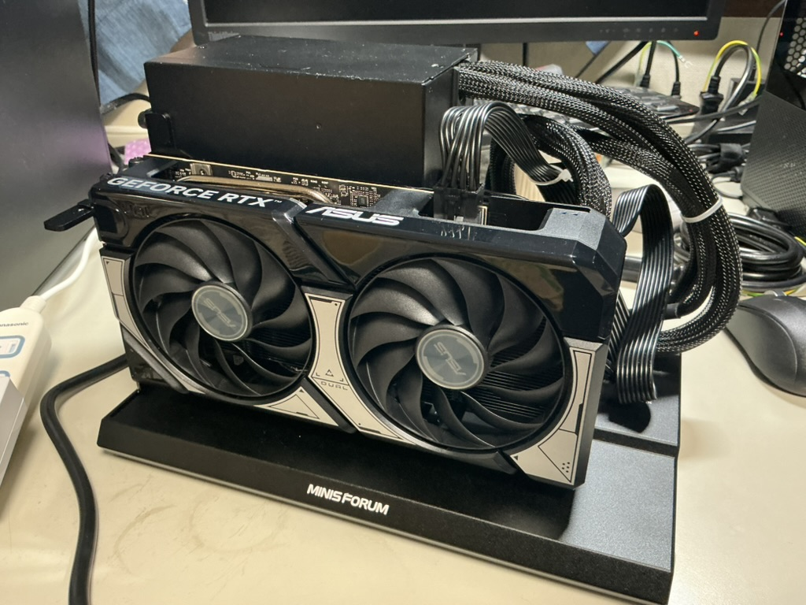
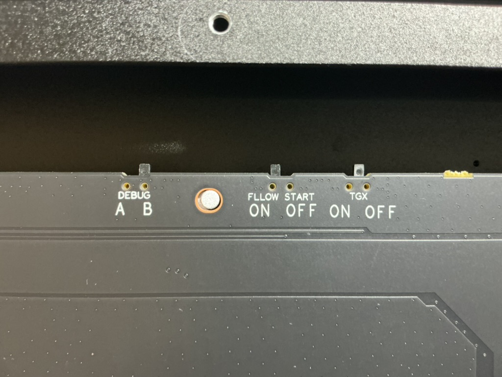
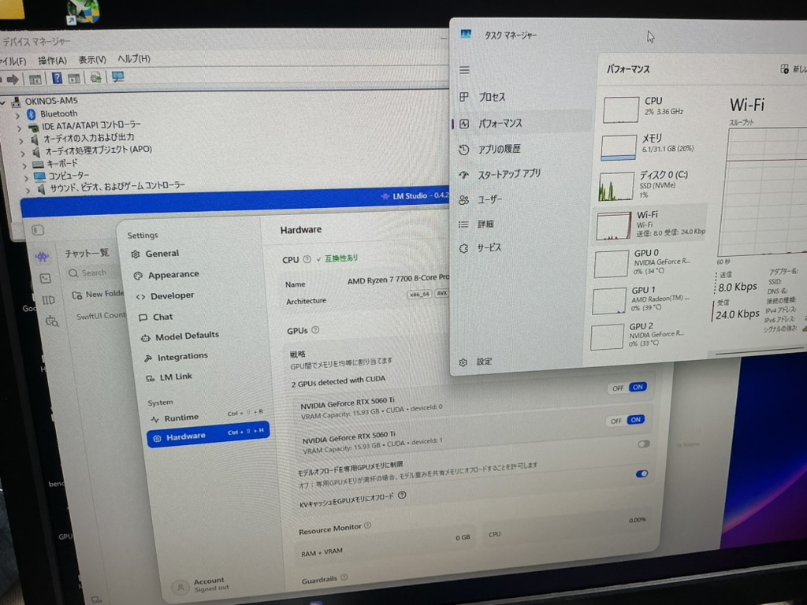
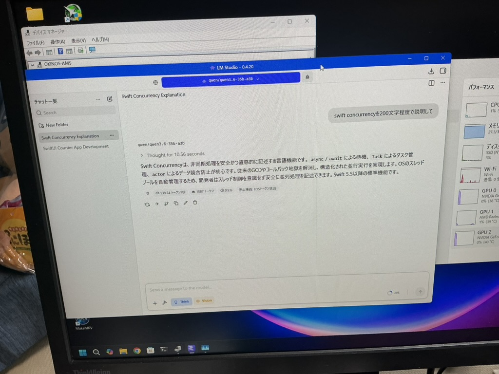

  
グラボを OCuLink で追加してみた

# グラボを OCuLink で追加してみた

<aside class="publication-note">
  
転載記事

  
これは 2026 年 8 月 7 日に mthr blog で掲載しました。本文を、表記を変えずに転載しています。埋め込み URL は印刷できるリンクカードに置き換えました。

  
掲載元：https://mthr.hatenablog.com/entry/2026/08/07/214317

</aside>

<!-- textlint-disable -->

正式に正規代理店からグラボの値上げが発表されました。ちょうど良いか、悪いタイミングというべきか、MiniMax H3 が発表されました。

さっそく、私の LLM 検証機に ComfyUI + MiniMax H3 の環境を構築してみることにしました。

  
  

    
ローカル LLM 素人が作るローカル LLM 検証機 - Qiita

    
qiita.com

    
https://qiita.com/mitsuharu_e/items/92a3eccb65d9b5c4ceca

  

<h2 id="Radeon-環境で-ComfyUI-を構築したいしようとした">Radeon 環境で ComfyUI を構築したい（しようとした）</h2>

普段使っている LLM 検証機は、Radeon のグラボを搭載しています。これまで Ollama や LM Studio で Radeon を使っていろいろ検証してきたので、今回もそのまま使えるだろうと思っていました。

しかし、ComfyUI の環境構築がなかなかうまくいきません。Python 3.12 をインストールしたり、公式サイトで配布されているインストーラーではなく GitHub からソースコードを取得して環境を構築したりと、いろいろ試しました。

なんとか ComfyUI 自体は起動できるところまで進んだものの、肝心の動画生成でエラーになりました。ここでいったん Radeon 環境での挑戦は諦めることにしました。

<h2 id="GeForce-ならあっさり動いた">GeForce ならあっさり動いた</h2>

そこで Geforce で構築した他の検証機で試しました。

<table>
<thead>
<tr>
<th style="text-align:left;"> パーツ </th>
<th style="text-align:left;"> 構成 </th>
</tr>
</thead>
<tbody>
<tr>
<td style="text-align:left;"> CPU   </td>
<td style="text-align:left;"> AMD Ryzen 7 7700 8-Core Processor（3.80 GHz） </td>
</tr>
<tr>
<td style="text-align:left;"> RAM   </td>
<td style="text-align:left;"> 32 GB </td>
</tr>
<tr>
<td style="text-align:left;"> GPU   </td>
<td style="text-align:left;"> NVIDIA GeForce RTX 5060 Ti 16 GB </td>
</tr>
</tbody>
</table>

こちらでは、公式サイトから ComfyUI のアプリをインストールして、画面をポチポチと進めていくだけで、動画生成ができました。Radeon 環境であれだけ苦労したのに...。

「これからは動画生成の時代だ！」

「グラボも値上げするから、今のうちに追いグラボだ！」

というのは半分冗談ですが、適当に中古パーツを眺めていたところ、RTX 5060 Ti 16 GB の中古品が手頃な価格で出ているのを発見しました。気がついたらポチっていました。

<h2 id="しかしグラボを挿す場所がない">しかし、グラボを挿す場所がない</h2>

この検証機は microATX でコンパクトに組んでいるため、RTX 5060 Ti をもう１枚取り付ける余裕はありません。

マザーボードには PCIe 4.0 x4 の１スロットの空きがありました。そこで、以前から興味があった OCuLink を使って、2枚目の GPU を外付けすることにしました。

<h2 id="OCuLink-で外付け-GPU-を接続する">OCuLink で外付け GPU を接続する</h2>

外付け GPU 用のドックとして Minisforum DEG1 を選択しました。有名どころであり、ちょうどアマゾンのタイムセールでした。

<a href="https://www.minisforum.jp/products/minisforum-deg1-egpu-dock">Minisforum DEG1 OcuLink&#x5916;&#x4ED8;&#x3051;GPU &#x30C9;&#x30C3;&#x30AD;&#x30F3;&#x30B0; &#x30B9;&#x30C6;&#x30FC;&#x30B7;&#x30E7;&#x30F3;</a><cite class="hatena-citation"><a href="https://www.minisforum.jp/products/minisforum-deg1-egpu-dock">www.minisforum.jp</a></cite>

検証機には OCuLink 端子がありません。そこで PCIe の拡張ボードを購入しました。これは検索して上にあったからという理由です。

  
  

    
Amazon

    
www.amazon.co.jp

    
https://www.amazon.co.jp/dp/B0F4RP1QG2

  

そういうことで、グラボをドックに組みました。

<figure class="figure-image figure-image-fotolife" title="RTX 5060 Ti 16GB on Minisforum DEG1"><figcaption>RTX 5060 Ti 16GB on Minisforum DEG1</figcaption></figure>

いざ PC に接続すると、映像が出なかったり、グラボが認識されなかったりと不安定になりました。中古グラボということで、初期不良も考えましたが他の PC で映像出力できたので、問題は OcuLink の接続周りです。

<h3 id="BIOS-で-PCIe-を-Gen-3-に固定">BIOS で PCIe を Gen 3 に固定</h3>

OCuLink の拡張ボードを接続している PCIe 4.0 x4 スロットのリンク速度を BIOS から Gen 3 に固定しました。初期値の AUTO のままだと GPU の認識が不安定でしたが、Gen 3 に落とすことで安定して認識するようになりました。

ライザーカードなどでもよくある PCIe の世代の問題ですね。帯域は落ちますが、今回の用途は特別問題はなさそうでした。モデルを VRAM にマウントした後の処理が大切なので、まずは安定性を優先することにしました。

<h3 id="MINISFORUM-DEG1-の設定変更">MINISFORUM DEG1 の設定変更</h3>

DEG1 側も設定を変更しました。

<ul>
<li>DEBUG：B</li>
<li>TGX：OFF</li>
</ul>

ドキュメント見当たらずで AI に聞いたところ、DEBUG の初期値 A は MINISFORUM 製品向けらしく、汎用向けとして B にしました。また、TGX は Lenovo 向けの設定らしい。詳しいのは知らないです。

<figure class="figure-image figure-image-fotolife" title="Minisforum DEG1  の裏蓋を開ける設定スイッチ"><figcaption>Minisforum DEG1  の裏蓋を開ける設定スイッチ</figcaption></figure>

これらの設定により外部接続したグラボが認識されました。検証機は RTX 5060 Ti ２枚を利用できるようになりました。

<figure class="figure-image figure-image-fotolife" title="OcuLink 接続したグラボを認識した"><figcaption>OcuLink 接続したグラボを認識した</figcaption></figure>

<h2 id="RTX-5060-Ti-16-GB-2-で検証">RTX 5060 Ti 16 GB ×2 で検証</h2>

16 GB の GPU が２枚使えるようになったので、マルチ GPU の検証をしてみました。約 20 GB のモデルを使用しました。RTX 5060 Ti 16 GB １枚では VRAM に収まりきらないサイズです。

１枚だけで動かしていたときは遅いと感じていましたが、２枚構成にするとかなり快適になりました。単純に VRAM が 32 GB になったことで、扱えるモデルの幅が大きく広がります。

<figure class="figure-image figure-image-fotolife" title="LLM 推論"><figcaption>LLM 推論</figcaption></figure>

<h3 id="LM-Studio-のマルチ-GPU-制御">LM Studio のマルチ GPU 制御</h3>

検証は LM Studio でしました。これまで Radeon ２枚構成でも同じような検証をしていたのですが、私の環境ではかなり不安定でした。不安定ならまだマシで、正直なところ利用するには厳しい状態でした。マルチ GPU は Ollama で動かしてました。

今回の LM Studio + GeForce 2枚構成 は、問題なく動いています。マルチ GPU で遊ぶなら GeForce のほうが圧倒的に楽ですね...。

<h2 id="まとめ">まとめ</h2>

これまでは Radeon を中心にローカル LLM 環境を構築して遊んできました。Radeon は VRAM 容量に対して価格が魅力的な製品も多く、Ollama や LM Studio で LLM を遊んでいます。一方で、ComfyUI やマルチ GPU まで手を広げると、やはり NVIDIA / CUDA を前提にした情報やツールの多さを実感します。

今回、OCuLink を使って RTX 5060 Ti 16 GB ×2、合計 32 GB の VRAM 環境を手に入れることができました。これでローカル LLM だけでなく、CUDA 利用を想定された画像・動画生成など、いろいろ試せる範囲が広がりそうです。

しかし、たまたま滑り込みでお手軽価格のグラボを見つけたとはいえ、これからグラボは値上げなので、辛いっすね。

<!-- textlint-enable -->
