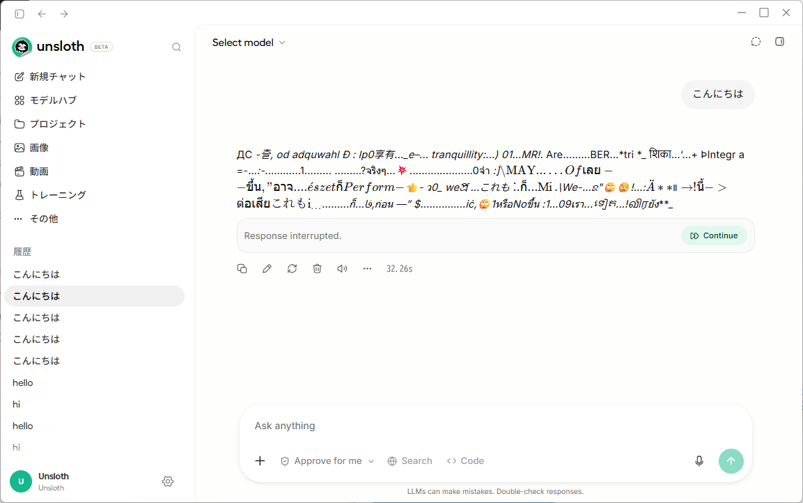
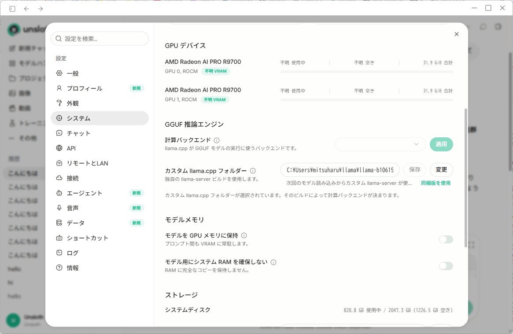
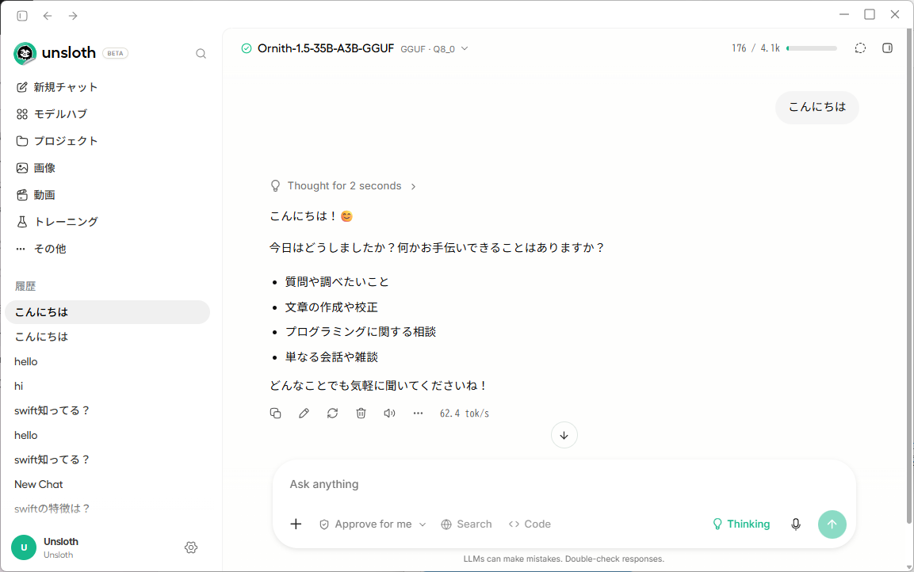

<div class="doc-header">
  <div class="doc-title">Windows + マルチ Radeon GPU 向けに llama.cpp をビルドする</div>
</div>

# Windows + マルチ Radeon GPU 向けに llama.cpp をビルドする

<aside class="publication-note">
  <div class="publication-note-label">Information</div>
  <div class="publication-note-text">これは 2026 年 8 月 25 日にブログで掲載しました。適宜、加筆修正しています。</div>
  <div class="publication-note-url">掲載元：https://mthr.hatenablog.com/entry/2026/08/25/190317</div>
</aside>

<!-- textlint-disable -->

私のメインとなる LLM 検証機は、Windows で複数の Radeon GPU を搭載しています。その RAM と VRAM はカジュアル用途には十分な量があるので満足していますが、１つ問題がありました。

<div class="link-card">
  
  <div class="link-card-body">
    <div class="link-card-title">ローカル LLM 素人が作るローカル LLM 検証機 - Qiita</div>
    <div class="link-card-domain">qiita.com</div>
    <div class="link-card-url">https://qiita.com/mitsuharu_e/items/92a3eccb65d9b5c4ceca</div>
  </div>
</div>

私は日常的に Ollama を採用して、LLM 推論を行なっています。個人的には、リッチな UI を持つ LM Studio なども併用したいところですが、この検証機では Ollama **だけ**を利用しています。なぜかというと、この検証機では必ずクラッシュするからです。LM Studio などは他の検証機でも利用していますが、複数の Radeon GPU がある環境では推論が失敗しました。



*推論過程で文字化けして止まる*

この例は Ollama ではないです。他の推論アプリで、このように文字化けして、推論が正しく動きません。文字化けならまだマシな方で、モデルを VRAM にマウントする途中で PC がクラッシュすることもあります。マウントしたグラボが動作無効の扱いになり、デバイスマネージャーから再有効する日々でした。

ちなみに、RTX 5060 Ti 16GB を２つ積んだ別の検証機だと、LM Studio で問題なくマルチ GPU は動作しました。マルチ Radeon GPU が問題のようです。

<div class="link-card">
  
  <div class="link-card-body">
    <div class="link-card-title">グラボを OCuLink で追加してみた - ブログ</div>
    <div class="link-card-domain">mthr.hatenablog.com</div>
    <div class="link-card-url">https://mthr.hatenablog.com/entry/2026/08/07/214317</div>
  </div>
</div>

そんなわけで、私が検証した限りでは正常に動作した Ollama を利用しています。Ollama がある限り、LLM 推論に問題はありません。しかしながら、Ollama しか利用できないのは、不安です。ツール依存はいつ問題が起こるか分かりません。

そこで、いろいろ調査していました。そのとき、ビルドオプションや ROCm の設定周りが影響してるのではと、アドバイスをいただきました。それを起点に調査と実装したところ、問題は解決しました（主に行なったのは Codex ですが）。

> おそらく Unsloth Studioのllama.cppはGGML CUDA NO PEER COPY=OFFでビルドされてる Ollamaのllama.cppはこの設定をONでビルドしている あとUnslothStudioの中のROCmなんだけど7.14らしいから 自身で入れているROCmがそれより古いとドライバーとRCCLの不整合でおかしな挙動するかも
>
> — CopenDeCamp (@CopenDeCamp) [2026年8月20日](https://x.com/CopenDeCamp/status/2090368867151618180?ref_src=twsrc%5Etfw)
>
> URL：https://x.com/CopenDeCamp/status/2090368867151618180

そんなわけで、Windows + マルチ Radeon GPU 向けの llama.cpp をビルドするリポジトリを公開しました。同環境で悩む人がいれば、これで対応できます（できるはずです）。

<div class="link-card">
  
  <div class="link-card-body">
    <div class="link-card-title">GitHub - mitsuharu/llama.cpp-windows-gpu-builder: 主に Windows + マルチ Radeon GPU 環境向けに llama.cpp をビルドする</div>
    <div class="link-card-domain">github.com</div>
    <div class="link-card-url">https://github.com/mitsuharu/llama.cpp-windows-gpu-builder</div>
  </div>
</div>

## ビルドの方針

主な方針は次の２点です。

1. GPU 間の peer copy を使わない
2. ROCm ランタイムを配布 ZIP に同梱する

### GPU 間の peer copy を使わない

本プロジェクトでは CUDA 版と ROCm 版の両方を、次の設定でビルドしています。名前には CUDA とありますが、現在の llama.cpp では ROCm バックエンドにも適用されます。

```text
GGML_CUDA_NO_PEER_COPY=ON
```

複数 GPU 間の直接コピーは高速です。一方で、私のように Windows で Radeon を複数組み合わせた環境や、PCIeの接続構成が異なる環境では、不安定要因になる可能性があります。

今回のビルドでは最高速度よりも、さまざまなマルチ GPU 構成での安定性を優先して peer copy を無効にしました。この設定は複数 GPU そのものを無効にするものではありません。異なる GPU 間で peer copy による直接転送を使わないという指定です。

Ollama は、Windows + ROCm 環境において、この機能を無効にしています。世間的に Ollama の推論は遅いと言われますが、これの安全に振った設定の副反応かもしれません、知らんけど。

```make
if(GGML_HIP AND OLLAMA_RUNNER_DIR MATCHES "^rocm_v")
    ollama_set_cache_default(CMAKE_HIP_FLAGS STRING
        "-parallel-jobs=4" "HIP compiler flags")
    if(WIN32)
        # Windows ROCm split-load needs peer copies disabled for correctness.
        ollama_set_cache_default(GGML_CUDA_NO_PEER_COPY BOOL ON
```

<div class="link-card">
  
  <div class="link-card-body">
    <div class="link-card-title">ollama/llama/server/CMakeLists.txt at v0.32.15 · ollama/ollama</div>
    <div class="link-card-domain">github.com</div>
    <div class="link-card-url">https://github.com/ollama/ollama/blob/v0.32.15/llama/server/CMakeLists.txt#L99</div>
  </div>
</div>

### ROCm ランタイムを配布 ZIP に同梱する

llama.cpp は、その GitHub リポジトリにて Windows + ROCm 向けのビルド済みファイルも配布しています。

<div class="link-card">
  
  <div class="link-card-body">
    <div class="link-card-title">GitHub - ggml-org/llama.cpp: LLM inference in C/C++</div>
    <div class="link-card-domain">github.com</div>
    <div class="link-card-url">https://github.com/ggml-org/llama.cpp</div>
  </div>
</div>

その ROCm 版には ROCm は同梱されておらず、各自のローカル環境に ROCm の導入が案内されています。ここで、ROCm 版をダウンロードしたが CPU 推論されたという記事を見ましたが、それは ROCm がその実行マシンに インストールされていない可能性がありますね。

<div class="link-card">
  
  <div class="link-card-body">
    <div class="link-card-title">llama.cpp on Windows with AMD ROCm (HIP) — Installation Guide · ggml-org llama.cpp · Discussion #27047</div>
    <div class="link-card-domain">github.com</div>
    <div class="link-card-url">https://github.com/ggml-org/llama.cpp/discussions/27047</div>
  </div>
</div>

この導入手順に従って ROCm を導入すると、Ollama など既存ツールがうまく動作しなくなりました。おそらく、導入過程で設定した環境変数などが、既存ツールの ROCm に干渉したのではと推測します。他に推論ツールを入れてなければ問題ないですが、いくつかのツールを利用するので、これはまずいです。

ここで Ollama は ROCm をインストールしてない環境でも、ROCm を利用しているのを思い出しました。そう ROCm を同梱してるのです。また、ROCm をインストールする方式では、ビルド時と実行時の ROCm のバージョンが異なる場合が多々あります。

そこで Ollama に近い考え方で、ROCm 版 ZIP に次のものをまとめました。

- llama.cpp の実行ファイル
- ROCm/HIP の実行時 DLL
- 間接的に必要になる DLL
- GPU ターゲット別カーネル
- 起動用 PowerShell スクリプト

別途、グラフィックドライバーの AMD Software: Adrenalin Edition アプリケーションのインストールが必要です。

<div class="link-card">
  
  <div class="link-card-body">
    <div class="link-card-title">AMD Software: Adrenalin Edition™ アプリケーション</div>
    <div class="link-card-domain">www.amd.com</div>
    <div class="link-card-url">https://www.amd.com/ja/products/software/adrenalin.html</div>
  </div>
</div>

この梱包アプローチにより、ROCm の個別インストールと（面倒くさい）環境変数の設定は不要になりました。導入が簡単になりました。

## 対応バックエンド

このリポジトリでは、Windows x64 向けに次のバックエンドに対応します。ただ、世間一般的に CUDA 前提で作られているので、ここでビルドする必要性はないです。Codex が作成してくれたので、残しています。

- NVIDIA CUDA
- AMD ROCm
- Vulkan

ROCm 版は gfx1200 や gfx1201 など、GPU ターゲットを選んでビルドします。

## ビルド環境

このリポジトリは、原則的に GitHub Actions Runner の Windows 仮想環境を用いて、ビルドします。llama.cpp のアップデート頻度が多い、ROCm などの各種バージョンをダウンロードしてたら、ローカル環境が汚染されてしまうからです。あと、雑に利用する検証機なので、Windows 自体を壊す可能性もあり、再インストールもありえます。そのため、ビルド環境は別に用意したかった

GitHub Actions のワークフローから、バックエンドの種類と llama.cpp のバージョンを選択すると、ビルドされた Zip ファイルが生成されます。そのファイルは GitHub Release に添付してるので、誰でもご利用できます。

## 実行例

ビルドされた llama.cpp を実行して、Windows + マルチ Radeon GPU の環境で LLM 推論ができるのか確認しました。

### Unsloth Desktop で動作実行する

今年8月、Unsloth からデスクトップ向けのアプリ Unsloth Desktop がリリースされました。

> Introducing Unsloth Desktop 🦥 The first desktop app to run and train models locally. • Open-source. Runs on Mac, Windows and Linux • Supports MLX, diffusion image/video, audio, GGUF • Connect Claude Code and Codex to local LLMs • 50% more accurate, self-healing tool calls +… [pic.twitter.com/vjTFB1e5IQ](https://t.co/vjTFB1e5IQ)
>
> — Unsloth AI (@UnslothAI) [2026年8月11日](https://x.com/UnslothAI/status/2087177146662072546?ref_src=twsrc%5Etfw)
>
> URL：https://x.com/UnslothAI/status/2087177146662072546

LM Studio は Bionic として、エージェント向けにシフトしたので、今は Unsloth Desktop を利用しています。LM Studio は従来アプリも更新されているので、Bionic と従来アプリの関係性がよく分からない。

<div class="link-card">
  
  <div class="link-card-body">
    <div class="link-card-title">LM Studio Bionic - Your Agent for Work and Code</div>
    <div class="link-card-domain">lmstudio.ai</div>
    <div class="link-card-url">https://lmstudio.ai/</div>
  </div>
</div>

さておき、Unsloth Desktop の直近のリリース [v0.1.801-beta](https://github.com/unslothai/unsloth/releases/tag/v0.1.801-beta) で、カスタム llama.cpp が指定できるようになりました。まさに私が抱えてる問題を解決するためのアップデートです。



*Unsloth Desktop でカスタム llama.cpp を指定する*

私がビルドした llama.cpp のディレクトリを指定して、LLM 推論を行いました。結果は無事に推論することができました。



*マルチ Radeon GPU 環境で LLM 推論が成功する*

これで、マルチ Radeon GPU でも自由に LLM 推論ができます！まあ、ほぼほぼ現行 Ollama が提供しているランタイムの真似やクローンでもあるんですが、自身で管理できるというメリットが大きいです。

## 注意点

- ROCm ランタイムを同梱するため ZIP は大きくなります
- AMDドライバーは別途必要です
- Radeon GPU に対応する gfx ターゲットを選ぶ必要があります
- peer copy 無効化は高速化ではなく、安定性を優先する設定です
- すべての GPU 環境での動作を保証するものではありません

## まとめ

私の Windows + マルチ Radeon GPU の環境では、Ollama で LLM 推論ができましたが、他の推論アプリではうまく動作しないケースが多々ありました。そこで、llama.cpp を GPU 間の peer copy を無効してビルドし、ROCm ランタイムを同梱する配布する方法を採用して、自身でビルドできる環境を構築しました。

その自身でビルドした llama.cpp のおかげで、不安定だった Windows + マルチ Radeon GPU の環境での LLM 推論は安定しました。わいのマルチ Radeon GPU 構成のローカル LLM が、さらに本気を出して動くぞい。

詳しいビルド処理、対応ターゲット、GitHub Actions、実行方法はリポジトリにまとめているので、興味ある方は参照してください。

<div class="link-card">
  
  <div class="link-card-body">
    <div class="link-card-title">GitHub - mitsuharu/llama.cpp-windows-gpu-builder: 主に Windows + マルチ Radeon GPU 環境向けに llama.cpp をビルドする</div>
    <div class="link-card-domain">github.com</div>
    <div class="link-card-url">https://github.com/mitsuharu/llama.cpp-windows-gpu-builder</div>
  </div>
</div>

<!-- textlint-enable -->
