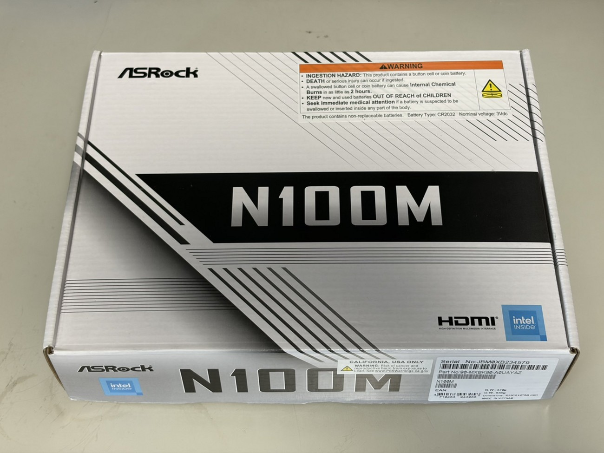

  
低スペック環境におけるローカル LLM の推論速度 / Intel N100 v.s. Ryzen 7 7700

# 低スペック環境におけるローカル LLM の推論速度 / Intel N100 v.s. Ryzen 7 7700

<aside class="publication-note">
  
Information

  
これは 2026 年 10 月 4 日にブログで掲載しました。適宜、加筆修正しています。

  
掲載元：https://mthr.hatenablog.com/entry/2026/10/04/163705

</aside>

<!-- 転載元の表記・文体・推測表現を保持するため、本文に限って該当ルールを除外する。 -->
<!-- textlint-disable prh, ja-spacing/ja-space-between-half-and-full-width, ja-spacing/ja-space-around-link, ja-spacing/ja-space-around-code, spellcheck-tech-word, ja-technical-writing/ja-no-weak-phrase, ja-technical-writing/no-mix-dearu-desumasu -->

ローカル LLM の推論速度には GPU に依存します。その計算能力や VRAM の容量と帯域が大きく影響します。では、GPU が同じで CPU やマザーボードが異なる環境ではどうなるのでしょうか。

手元に、NVIDIA GeForce RTX 5060 Ti (16 GB) を搭載した 2 台のマシンがあります。片方は Intel N100 + ASRock N100M、もう片方は AMD Ryzen 7 7700 + ASRock B650M Pro X3D WiFi です。

N100 は低電力に特化した CPU で、数値計算にはあまり向きません。そのCPU の性能差は Cinebench のマルチスレッドで約 7 倍もあります。この 2 台で、[Ollama](https://ollama.com/) を使って次の 2 つのモデルの速度を比べてみました。

- GPU にすべて乗るモデル [gemma4:12b](https://ollama.com/library/gemma4:12b)
- GPU に乗り切らないモデル [qwen3.8:27b](https://ollama.com/library/qwen3.8:27b)

## 検証環境

今回取り上げる N100 は依然にブログで書いたマシンになります。詳細が気になる方は、その記事もどうぞ。

  
  

    
Intel N100 を搭載したマザーボード ASRock N100M を購入したよ - mthr blog

    
https://mthr.hatenablog.com/entry/2026/05/31/115701

  

### マシンスペック

比較するマシンのスペックは以下のようになります。ここで、それぞれの機種は CPU から呼称します。なお、ともに OS は Windows 11 Home です。

| 項目 | N100 | Ryzen 7 7700 |
| --- | --- | --- |
| CPU | Intel N100（4 コア / 4 スレッド、最大 3.4 GHz、TDP 6 W） | AMD Ryzen 7 7700（8 コア / 16 スレッド、最大 5.3 GHz、TDP 65 W） |
| マザーボード | ASRock N100M（CPU オンボード） | ASRock B650M Pro X3D WiFi |
| メモリ | 32 GB DDR4（シングルチャネル） | 64 GB DDR5（デュアルチャネル、16GB x4） |
| GPU | NVIDIA GeForce RTX 5060 Ti (16 GB) | NVIDIA GeForce RTX 5060 Ti (16 GB) |
| GPU の接続 | PCIe 3.0 x2 | PCIe 5.0 x8 |

RTX 5060 Ti 16GB は、GDDR7 128 bit で 448 GB/s のメモリ帯域を持ち、PCIe 5.0 x8 で接続するカードです。

### CPU の性能（Cinebench）

Microsoft Store 版で配布されている Cinebench 2026 で計測しました。

| 項目 | N100 | Ryzen 7 7700 | 差 |
| --- | --- | --- | --- |
| マルチスレッド | 594 pt | 4,257 pt | 約 7.2 倍 |
| シングルスレッド | 233 pt | 451 pt | 約 1.9 倍 |

マルチスレッドで 7 倍、シングルスレッドで 2 倍ほどの差です。N100 は省電力向けの E コアだけの CPU なので、まあそうなりますね。

### マザーボードとバスの違い

LLM の速度に効きそうなところを、カタログ値で比べてみます。

| 項目 | N100 | Ryzen 7 7700 | 差 |
| --- | --- | --- | --- |
| GPU とのリンク | PCIe 3.0 x2（約 2 GB/s） | PCIe 5.0 x8（約 31.5 GB/s） | 約 16 倍 |
| メモリ | DDR4-3200 シングルチャネル | DDR5 デュアルチャネル |  |
| メモリ帯域（理論値） | 25.6 GB/s | 57.6 GB/s（4枚構成なので DDR5-3600） | 約 2.3 倍 |
| ベクトル命令 | AVX2 まで | AVX-512 対応 |  |

ASRock N100M の PCIe スロットは物理的には x16 ですが、電気的には PCIe 3.0 x2 で動きます。N100 自体が PCIe 3.0 を最大 9 レーンしか持っていないためです。RTX 5060 Ti は本来 PCIe 5.0 x8 のカードなので、N100 機では帯域が 1/16 ほどに絞られています。

一方、B650M Pro X3D WiFi のスロットは CPU 直結の PCIe 5.0 x16 なので、RTX 5060 Ti の PCIe 5.0 x8 をフルに使えます。

メモリに関して、N100 はシングルチャネルしか使えません。Ryzen 7 7700 はデュアルチャネルの DDR5 です。ただし、4 枚挿しのときの AMD の公式サポートは DDR5-3600 までなので、2 枚挿しの DDR5-5200 よりは控えめな値になります。

## 計測方法

計測には、自作の Agent Skill [benchmark-ollama-llm](https://github.com/mitsuharu/agent-skills/blob/main/skills/benchmark-ollama-llm/SKILL.md) を使いました。Ollama の `/api/generate` にストリーミングで同じプロンプトを繰り返し送り、入力・出力の tok/s や思考時間、回答時間を測るスキルです。

### 対象モデル

| モデル | サイズ | 量子化 | GPU（16 GB）への載り方 |
| --- | --- | --- | --- |
| [gemma4:12b](https://ollama.com/library/gemma4:12b) | 8.0 GB | Q4_K_M | すべて乗る |
| [qwen3.8:27b](https://ollama.com/library/qwen3.8:27b) | 18 GB | Q4_K_M | 乗り切らない |

qwen3.8:27b は、計測中の `/api/ps` で見ると 18.1 GB のうち 12.8 GB が GPU に乗り、残りの約 5.3 GB（約 3 割）が CPU 側のメモリで動いていました。これは 2 台とも同じです。

## 結果

N100 の qwen3.8:27b はあまりに遅かったので、途中で計測を 2 回に減らしました。Ryzen 7 7700 機では 10 回測っています。

### gemma4:12b（GPU にすべて乗る）

| 項目 | N100 | Ryzen 7 7700 | 差 |
| --- | --- | --- | --- |
| 出力速度 | 82.97 tok/s | 98.38 tok/s | 1.19 倍 |
| 入力速度 | 456.35 tok/s | 880.75 tok/s | 1.93 倍 |
| 出力前の待ち時間 | 0.250 秒 | 0.114 秒 |  |
| 思考時間 | 8.286 秒 | 6.944 秒 |  |
| 回答時間 | 15.651 秒 | 13.245 秒 |  |
| 1 回の合計 | 24.186 秒 | 20.303 秒 | 約 16 % 短縮 |
| モデルのロード（ウォームアップ時） | 15.05 秒 | 7.46 秒 |  |

GPU にすべて乗る gemma4:12b では、出力速度の差は約 1.2 倍でした。CPU のマルチスレッド性能が 7 倍違うことを考えると、思ったより差が出ません。

### qwen3.8:27b（GPU に乗り切らない）

| 項目 | N100 機（2 回） | Ryzen 7 7700 機（10 回） | 差 |
| --- | --- | --- | --- |
| 出力速度 | 2.67 tok/s | 16.18 tok/s | 6.06 倍 |
| 入力速度 | 42.14 tok/s | 213.00 tok/s | 5.05 倍 |
| 出力前の待ち時間 | 1.354 秒 | 0.244 秒 |  |
| 思考時間 | 213.155 秒 | 31.282 秒 |  |
| 回答時間 | 552.681 秒 | 95.333 秒 |  |
| 1 回の合計 | 767.190 秒（約 12.8 分） | 126.859 秒（約 2.1 分） | 6.05 倍 |
| モデルのロード（ウォームアップ時） | 33.00 秒 | 7.56 秒 |  |

GPU に乗り切らない qwen3.8:27b では、一気に約 6 倍の差になりました。N100 では 1 回の回答に 13 分近くかかります。2.67 tok/s だと、文字が出てくるのを眺めていられるくらいの遅さです。Ryzen 7 7700 機の 16 tok/s なら、読む速さとそんなに変わらないので普通に使えます。

### 消費電力

計測中の消費電力の目安です。電源プラグにワットチェッカーをつけて、計測中に目視で確認しました。

| 状態 | N100 | Ryzen 7 7700 |
| --- | --- | --- |
| 通常時 | 30〜40 W | 50〜60 W |
| gemma4:12b 計測中 | 210〜220 W | 240〜250 W |
| qwen3.8:27b 計測中 | 55〜65 W | 180〜190 W |

注目したいのは、N100 機で qwen3.8:27b を動かしているときの 55〜65 W です。gemma4:12b のときは 210 W を超えているので、qwen のときは GPU がほとんど遊んでいることになります。CPU オフロードに時間がかかって、そもそもの計算ができなかったかもしれません。

## 考察

### GPU に全部乗るなら、CPU の差はほぼ効かない

モデルが VRAM に全部乗っていれば、トークンの生成は GPU の中で完結します。1 トークンを出すたびに重み全体を VRAM から読むので、速度を決めるのは主に VRAM の帯域（448 GB/s）です。この部分は 2 台で同じなので、速度もほぼ同じになります。

それでも 1.2 倍の差が出たのは、CPU 側の処理が 1 トークンごとに少しずつ挟まるからだと思います。サンプリングや GPU へのカーネル投入、Ollama 自体の処理などです。1 トークンあたりの時間で見ると、N100 機は 12.05 ミリ秒、Ryzen 7 7700 機は 10.16 ミリ秒で、差は約 1.9 ミリ秒です。この差がそういった CPU 側のオーバーヘッドの差と考えると、シングルスレッド性能の差（約 1.9 倍）がそれなりに効いていそうです。

入力速度も約 1.9 倍違いますが、これは額面どおりには受け取れません。プロンプトは 55 トークンしかなく、そのうち 50 トークンはキャッシュから読まれています。なので、プロンプト処理の性能というより、リクエストごとの固定のオーバーヘッドを測っている値です。ここでもシングルスレッド性能の差が見えている、くらいに捉えるのがよさそうです。

PCIe の帯域は 16 倍も違いますが、生成速度にはほとんど効いていません。モデルが VRAM に乗ってしまえば、生成中に PCIe を流れるデータはごくわずかだからです。PCIe の差がはっきり見えるのはモデルのロード時間で、gemma4:12b は N100 機で 15.1 秒、Ryzen 7 7700 機で 7.5 秒でした。ただし、ここにはストレージからの読み込みも含まれるので、純粋な PCIe の差ではありません（N100M の M.2 も PCIe 3.0 x2 です）。

### GPU に乗り切らないと、CPU の差がそのまま出る

qwen3.8:27b は約 3 割が CPU 側に溢れています。こうなると、1 トークンを出すたびに CPU が自分の担当分の重みを処理し終わるまで、GPU は待たされます。全体の速度は遅い方、つまり CPU 側に引っ張られます。

CPU 側の処理を律速するものとして、メモリ帯域と演算性能の 2 つが考えられます。それぞれの差と、実際の速度差を並べてみます。

| 指標 | N100 機に対する Ryzen 7 7700 機の倍率 |
| --- | --- |
| メモリ帯域（理論値、DDR5-3600 の場合） | 約 2.3 倍 |
| Cinebench シングルスレッド | 約 1.9 倍 |
| **qwen3.8:27b の出力速度** | **約 6.1 倍** |
| Cinebench マルチスレッド | 約 7.2 倍 |

実際の速度差（6.1 倍）は、メモリ帯域の差（2.3 倍）よりずっと大きく、マルチスレッド性能の差（7.2 倍）に近い値です。つまり、N100 機ではメモリ帯域よりも先に、CPU の演算性能が足りずに詰まっていると考えられます。4 コアの E コアで AVX2 までしか使えない N100 に対して、Ryzen 7 7700 は 8 コア 16 スレッドで AVX-512 も使えるので、行列演算の処理量が段違いです。

消費電力もこれを裏付けています。N100 機で qwen を動かしているときの 55〜65 W は、GPU がほぼ待ちぼうけで、CPU だけが必死に計算している状態です。Ryzen 7 7700 機では 180〜190 W まで上がっていて、GPU もそれなりに仕事をできています。

ちなみに、Ryzen 7 7700 機でも qwen3.8:27b の 16 tok/s は gemma4:12b の 98 tok/s の 1/6 ほどです。モデルのサイズが 2 倍ちょっとであることを考えても、GPU に乗り切らないことによる落ち込みはかなり大きいです。VRAM に全部乗せるのが一番の近道なのは変わりません。

### 電力効率でも Ryzen 7 7700 機が有利

消費電力の目安（各範囲の中央値）と計測結果から、1 回の推論にかかる電力量を出してみます。

| モデル | N100 機 | Ryzen 7 7700 機 |
| --- | --- | --- |
| gemma4:12b | 約 215 W × 24.2 秒 ≒ 1.45 Wh | 約 245 W × 20.3 秒 ≒ 1.38 Wh |
| qwen3.8:27b | 約 60 W × 767 秒 ≒ 12.8 Wh | 約 185 W × 127 秒 ≒ 6.5 Wh |

gemma4:12b ではほぼ互角です。qwen3.8:27b では、Ryzen 7 7700 機の方が瞬間的な消費電力は 3 倍高いのに、1 回あたりの電力量は半分で済んでいます。遅いマシンでダラダラ回すより、速いマシンでさっさと終わらせた方が省エネということですね。

N100 機が省電力で有利なのは、通常時の 30〜40 W くらいです。常時起動しておいて、GPU に乗るモデルだけを動かすサーバーとしてなら、N100 機もアリだと思います。

## 注意点

今回の比較には、いくつか条件の揃っていないところがあります。

- **N100 機の qwen3.8:27b は 2 回だけ:** 遅すぎたので回数を減らしました。ただ、2 回の出力速度は 2.64 tok/s と 2.71 tok/s で、ばらつきは小さいです。
- **qwen3.8:27b の回答は途中で打ち切られている:** 両機とも毎回 2048 トークンの上限に達しています。回答時間は回答全体ではなく、上限までの時間です。出力トークン数は同じなので、tok/s の比較には問題ありません。
- **出力の中身が少し違う:** temperature 0 でも、qwen3.8:27b の思考の文字数は N100 機で 2,073 文字、Ryzen 7 7700 機で 1,880 文字と違っていました。CPU 側の計算の違いで結果が少しずれているようです。そのため、思考時間や回答時間よりも tok/s で比べるのが公平です。
- **入力速度は参考値:** 短いプロンプトでキャッシュが効いているので、長いプロンプトでのプロンプト処理の性能は測れていません。長いプロンプトでは、CPU 側の重みを GPU に転送して処理する場面が増えるので、PCIe 3.0 x2 の狭さが効いてくる可能性があります。
- **消費電力は目安:** システム全体の消費電力を、計測中のおおよその範囲で読んだ値です。

## まとめ

同じ RTX 5060 Ti 16GB を、N100 機と Ryzen 7 7700 機に挿して、Ollama で LLM の速度を比べました。

- GPU にすべて乗る gemma4:12b では、出力速度の差は約 1.2 倍（83 tok/s と 98 tok/s）でした。CPU、メモリ、PCIe がこれだけ違っても、VRAM に乗っていればほぼ GPU の性能で決まります。
- GPU に乗り切らない qwen3.8:27b では、約 6 倍（2.7 tok/s と 16 tok/s）の差になりました。この差はメモリ帯域の差より CPU のマルチスレッド性能の差に近く、N100 では CPU の演算性能がボトルネックになっていそうです。
- PCIe 3.0 x2 の狭さは、今回の条件では生成速度にほとんど効かず、モデルのロード時間に表れる程度でした。

VRAM に乗るモデルを動かすだけなら、CPU は N100 でも十分戦えます。省電力な常時起動の LLM サーバーとしては、むしろ魅力的かもしれません。一方で、VRAM から溢れるモデルも使いたいなら、CPU とメモリにもしっかり投資した方がいいです。

次は、長いプロンプトでのプロンプト処理や、CPU に溢れる割合を変えたときの速度も調べてみたいと思います。

## 参考

- [benchmark-ollama-llm（mitsuharu/agent-skills）](https://github.com/mitsuharu/agent-skills/blob/main/skills/benchmark-ollama-llm/SKILL.md)
- [ASRock N100M 仕様](https://www.asrock.com/mb/Intel/N100M/)
- [ASRock B650M Pro X3D WiFi 仕様](https://www.asrock.com/MB/AMD/B650M%20Pro%20X3D%20WiFi/index.asp)
- [Intel Processor N100 仕様](https://www.intel.com/content/www/us/en/products/sku/231803/intel-processor-n100-6m-cache-up-to-3-40-ghz/specifications.html)
- [AMD Ryzen 7 7700 仕様](https://www.amd.com/en/products/processors/desktops/ryzen/7000-series/amd-ryzen-7-7700.html)
- [NVIDIA GeForce RTX 5060 Ti 16GB Specs（TechSpot）](https://www.techspot.com/specs/gpu/307872-nvidia-geforce-rtx-5060-ti-16gb.html)
- [gemma4:12b（Ollama）](https://ollama.com/library/gemma4:12b)
- [qwen3.8:27b（Ollama）](https://ollama.com/library/qwen3.8:27b)

<!-- textlint-enable prh, ja-spacing/ja-space-between-half-and-full-width, ja-spacing/ja-space-around-link, ja-spacing/ja-space-around-code, spellcheck-tech-word, ja-technical-writing/ja-no-weak-phrase, ja-technical-writing/no-mix-dearu-desumasu -->
